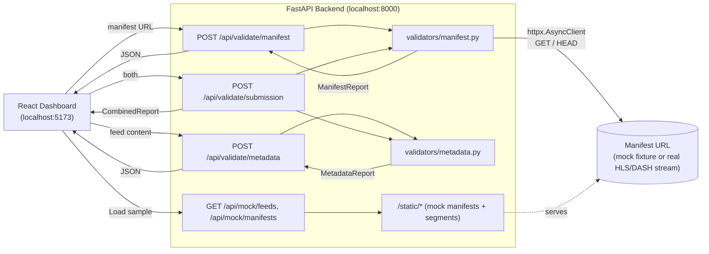
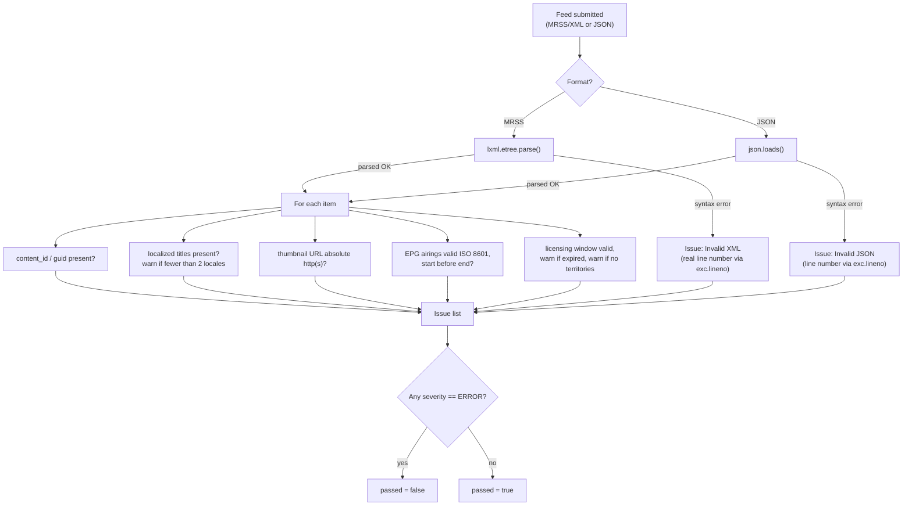
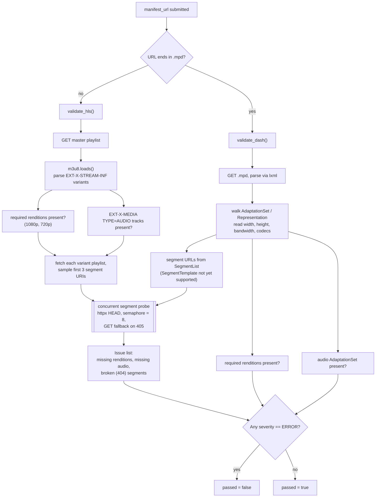

# Building the Media Partner Ingestion Validator

*A record of how it happened, start to finish — a working simulation of the
pre-flight tooling a YouTube TV Partner Engineer runs before a channel's
content goes live.*

---

## Why I built this

I was looking at YouTube's **TV Partner Engineer** role. The posting is
specific about what the job actually is: *"improve operations by developing
automation scripts and dashboards,"* *"guarantee the technical aspects of a
partner's integration... by providing necessary documentation and technical
guidance,"* and *"providing product input for partner self-service tools and
applications."* Preferred qualifications call out XML/HTML troubleshooting
and running scripts in Python specifically.

Rather than just list those phrases on a resume, I wanted to build the actual
thing the job describes — a self-service tool a media/TV partner would use to
check their submission before an operations team ever has to look at it by
hand. Real sports-broadcast partner scenarios (an F1 race replay, a football
match highlights package) stood in for the kind of content this would
actually gate.

## What a partner submission has to get right

Two artifacts, two different kinds of failure:

1. **Schedule metadata** — an MRSS/XML or JSON feed describing the content:
   localized titles, a thumbnail, an EPG airing window, and a licensing
   window with territory rights. Get this wrong and the content is
   technically playable but mis-described, mis-scheduled, or legally exposed.
2. **A media manifest** — the actual HLS (`.m3u8`) or DASH (`.mpd`) file
   describing the video. Get this wrong and playback itself breaks: a
   resolution is missing, there's no audio track, or a video segment 404s
   mid-stream.

Both categories of failure are boring and repetitive by nature — the same
handful of mistakes, over and over, across every partner. That repetitiveness
is exactly what makes them automatable.

## Designing the two checks

**Metadata** (`app/validators/metadata.py`) needed two parsers behind one
contract, since real partners submit either MRSS/XML or JSON. XML errors
needed to point at a literal file — *"line 42 is missing an `xml:lang`
attribute"* — not just "something's wrong somewhere," so error messages are
actionable without partner engineers re-reading the whole file.

**Manifests** (`app/validators/manifest.py`) needed to answer a more
consequential question: *would this actually play?* Not just "is the XML
well-formed," but "does the rendition ladder have the resolutions it claims,
is there an audio track, and do the individual video segments the player
would request actually exist." That last one is why the manifest validator
makes real, live HTTP requests instead of only reading text — a manifest can
be perfectly well-formed and still point at a segment file that was deleted
or never uploaded.

## Building it for real, not faked

The easy way to build a demo is to hand-write JSON that *looks like* a
report. I didn't do that. `scripts/generate_fixtures.py` writes actual
`.m3u8`/`.mpd` files and actual (dummy) `.ts`/`.m4s` segment files to disk,
served by the backend's own `StaticFiles` mount. The "broken" fixtures are
broken for real: a segment file is simply never written, so when the
validator HEAD-requests it, the 404 it reports back is a real 404 from a
real HTTP server, not a scripted response.



## Proving it actually works — and catching a real bug while writing this doc

22 tests (`pytest`) cover both validators and every API endpoint, including
the live-404 path, with zero mocking of HTTP behavior — see [The ASGI-transport
testing trick](#the-asgi-transport-testing-trick) below for how that's done
without a live server.

While re-verifying these numbers for this document, one of them had actually
started failing: `test_valid_mrss_passes`.

```
AssertionError: assert [Issue(severity=<Severity.WARNING: 'warning'>,
field='item[0]/licensing:window', message='Licensing window has already
expired.', line=16)] == []
```

The cause was a real, honest bug, not a flaky test: the "valid" F1 fixture's
licensing window had been hardcoded to a fixed 2026 date range back when the
fixtures were first generated. Once real calendar time passed that range,
the validator correctly started flagging it as expired — the *validation
logic* was right, the *fixture* was a time bomb. I fixed it by generating
the EPG/licensing dates in `generate_fixtures.py` relative to the moment the
script runs (`NOW - timedelta(...)` / `NOW + timedelta(...)`) instead of
hardcoding calendar dates, regenerated the fixtures, and confirmed all 22
tests pass again — committed as
[`4493906`](https://github.com/aditeya08varma/tv-partner-ingestion-validator/commit/4493906).
It's a small bug, but it's a genuine example of exactly the kind of
time-dependent fixture rot this validator itself is designed to catch in
other people's data.

## Testing it against reality, not just my own mocks

Mock fixtures prove the validator works against data I designed to be caught.
The more honest test is real-world manifests I didn't build. HLS and DASH
are published specs, so I pointed the actual validator at public production
streams:

| Stream | Result |
|---|---|
| Apple's `bipbop` advanced HLS example | **PASS** — found 1080p/720p renditions, 3 audio tracks, probed **72 real segments, 0 broken** |
| Unified Streaming's "Tears of Steel" HLS demo | **FAIL (correctly)** — its ladder tops out below 1080p/720p and declares no audio group; a legitimately non-compliant real-world stream, not a bug |
| Akamai's "Big Buck Bunny" DASH demo | **PASS** on renditions (1080p/720p found) and audio, but **`segments_checked: 0`** |

That last result surfaced a real, honest limitation rather than a success:
the DASH validator only extracts segment URLs from `<SegmentList>`, and this
manifest — like most production DASH — uses `<SegmentTemplate>` instead.
Rendition and audio detection still work correctly against it; the live
segment-probe step is silently skipped for `SegmentTemplate`-style manifests.
That's documented here rather than glossed over, and it's the clearest next
thing to build if this went further.

## Technical depth

*The story above covers the reasoning. This is the actual mechanics.*

### Metadata validation, in full



The reason this uses `lxml` instead of the standard-library `xml.etree` is
one specific capability: `lxml` exposes `.sourceline` on every parsed
element. `xml.etree` doesn't track source positions at all. Without it, the
best an error message can say is "somewhere in your file"; with it, every
issue carries the exact line a partner needs to open.

The check that actually uses it, from `metadata.py`:

```python
titles = item.findall("media:title", namespaces=ns)
...
for t in titles:
    lang = t.get("{http://www.w3.org/XML/1998/namespace}lang")
    if not lang:
        issues.append(Issue(
            severity=Severity.ERROR,
            field=f"{locator}/media:title",
            message="<media:title> is missing an xml:lang attribute — titles must be localized.",
            line=t.sourceline,
        ))
```

JSON feeds don't have line numbers to report, so errors there use a
JSONPath-style locator instead (`$.items[0].licensing_window`) — different
mechanism, same goal: point exactly at the broken field.

### Manifest validation, in full



The segment probe is the part worth explaining, since checking a full
rendition ladder's segments is a fan-out I/O problem, not a CPU one — the
work is "wait on a lot of HTTP responses," not "compute something." It's
bounded with a semaphore so a manifest with hundreds of segments can't open
hundreds of simultaneous connections:

```python
async def _check_segments(client: httpx.AsyncClient, urls: list[str]) -> list[SegmentCheck]:
    sem = asyncio.Semaphore(MAX_CONCURRENT_SEGMENT_CHECKS)  # 8
    results = await asyncio.gather(*[_check_segment(client, u, sem) for u in urls])
    return list(results)
```

Each check does a `HEAD` first (a "does this exist" check shouldn't need to
download the file), falling back to `GET` only if the server rejects `HEAD`
with `405`:

```python
resp = await client.head(url, timeout=8.0, follow_redirects=True)
if resp.status_code == 405:
    resp = await client.get(url, timeout=8.0, follow_redirects=True)
ok = resp.status_code < 400
```

### The ASGI-transport testing trick

The manifest validator's entire value is that it makes *real* HTTP calls.
Mocking those away in tests would mean testing nothing — a test double that
always returns 200 proves the code compiles, not that 404 detection works.
Instead, `tests/conftest.py` rewires the app's HTTP client to route through
`httpx.ASGITransport(app=app)`:

```python
app.state.http_client = httpx.AsyncClient(
    transport=ASGITransport(app=app), base_url="http://testserver"
)
```

That transport sends every request directly into the same FastAPI app
in-process — no socket, no port, no live server — while still executing the
*real* code path: the real `StaticFiles` mount, a real 404 response for a
segment file that was genuinely never written to disk, a real 200 for one
that was. The 404-detection logic is exercised for real, deterministically,
in 0.4 seconds, with no network flakiness possible.

## Why this tech stack

| Layer | Choice | Why this, specifically |
|---|---|---|
| **Backend API** | Python + FastAPI | Async-native, so segment-URL probing (many concurrent HTTP requests per manifest) doesn't block the event loop. Pydantic models give the validators a typed, self-documenting output contract, and FastAPI turns that straight into OpenAPI docs (`/docs`). |
| **XML parsing** | `lxml` | `xml.etree` can't report source line numbers; `lxml` exposes `.sourceline` on every element, which is what makes *"line 42"*-style errors possible at all. |
| **HLS parsing** | `m3u8` | Purpose-built for master/variant playlists, `EXT-X-STREAM-INF`, and `EXT-X-MEDIA`, instead of hand-rolling an M3U8 grammar. |
| **DASH parsing** | `lxml` (direct MPD XML) | No lightweight pure-Python DASH library covers `.mpd` the way `m3u8` covers HLS; `AdaptationSet`/`Representation`/`SegmentList` is a small enough surface to parse directly. |
| **Segment probing** | `httpx.AsyncClient` | Concurrent HEAD requests (GET fallback on 405), bounded by a semaphore — a fan-out I/O problem, not a CPU one. |
| **Frontend** | React + TypeScript | Three report shapes (metadata / manifest / combined) have to render consistently; TypeScript interfaces mirroring the Pydantic models catch response-shape drift at compile time. |
| **Build tooling** | Vite | Fast dev iteration with an API proxy to FastAPI, avoiding CORS friction in dev while `app/main.py` still runs real CORS middleware for Docker/deployed use. |
| **Containerization** | Docker + Docker Compose | Two independently deployable services, wired into one command for local/demo use. |
| **Testing** | pytest + pytest-asyncio, in-process ASGI transport | Exercises the real HTTP 404-detection path with zero live server and zero network flakiness — see above. |

## Metrics

Verified directly against this repository, not estimated:

- **1,074** lines of backend Python (validators, routers, models, config)
- **461** lines of frontend TypeScript/TSX
- **22/22** tests passing (`pytest`, 0.4s, in-process, no live server)
- **51** distinct validation rules across the two validators — 40 in
  `metadata.py` (titles/thumbnail/EPG/licensing), 11 in `manifest.py`
  (renditions/audio/segments, HLS + DASH)
- **10** mock fixtures (4 metadata feeds, 6 manifests across HLS/DASH), each
  with a deliberately valid and a deliberately broken variant
- **149.98 kB** production frontend bundle (48.06 kB gzipped)
- Validated against **4 real, public production HLS/DASH streams** (Apple,
  Akamai, Unified Streaming) in addition to the project's own fixtures
- **0** required external services — the full demo runs offline

## What it actually is, in the end

A working, tested simulation of the specific self-service tooling a TV
Partner Engineer role describes building: two real parsers, real HTTP
verification instead of simulated pass/fail, a dashboard that reports
exactly what's wrong instead of just whether something's wrong, and a test
suite honest enough to have caught its own fixture going stale mid-writeup.

**Repo:** [github.com/aditeya08varma/tv-partner-ingestion-validator](https://github.com/aditeya08varma/tv-partner-ingestion-validator)
